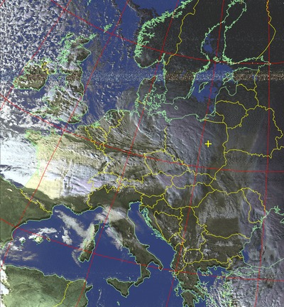
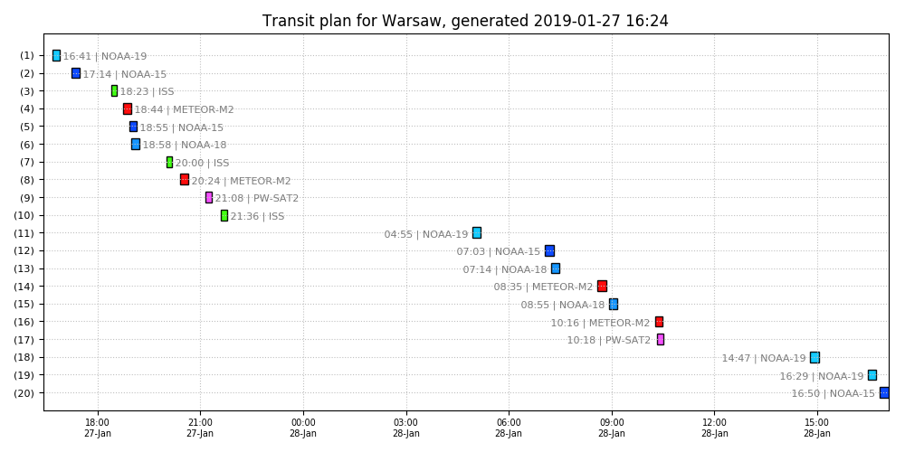

# autowx2

**autowx2** is the python program for schedule satellite and ground recordings with SDR dongle. Bundled plugins include scripts for processing weather APT images from NOAA satellites and ISS voice communication recordings.

 


This is a rewritten and fine-tuned version of tools for the automatic weather satellite images capturing. Most directly it bases on cyber-atomus' [autowx](https://github.com/cyber-atomus/autowx) and my fork of autowx. The main differences between this project **autowx2** and previously created tools:
- **high modularity** - all recording and processing are done by separate scripts (modules? plugins?), which can be easily configured to meet one's needs. The main module (called *noaa*) is devoted to the capture of weather data from the NOAA satellites, but with other modules (i.e., *ISS* voice) one can record voice communication from the satellite (tested for ISS :tada: !).
- **configurability** - most (all?) variables can be set up in the config file. For both: the main program and the NOAA module.
- **flexibility** - it can be set up to record satellite transmissions based on the passing predictions as well as fixed time recordings, configured via cron-like syntax.
- **simplicity** (not sure if this is true). List of observed satellites is defined in one place only (the config file) and can be easily modified.
- **time efficiency** - it can perform sdr-related tasks to do between scheduled transmissions (see below)
- other features include: autocallibration between recordings with [kalibrate-rtl](https://github.com/viraptor/kalibrate-rtl); prioritization of recordings (eg., when passing time overlaps, choose one with a higher priority); generation of the [passing/recording table](#genpasstablepy) for the next few hours (static html + image);

<!--- [](https://ghit.me/repo/filipsPL/autowx2) -->

[](https://travis-ci.org/filipsPL/autowx2) [](https://www.codacy.com/app/filipsPL/autowx2?utm_source=github.com&amp;utm_medium=referral&amp;utm_content=filipsPL/autowx2&amp;utm_campaign=Badge_Grade) [](https://app.fossa.io/projects/git%2Bgithub.com%2FfilipsPL%2Fautowx2?ref=badge_shield)  [](https://pyup.io/repos/github/filipsPL/autowx2/)  [](https://github.com/filipsPL/autowx2/releases) 

**autowx2** was tested and successfully applied to schedule recordings of:
- [x] NOAA weather satellites
- [x] ISS transmissions (voice, [SSTV](https://github.com/filipsPL/autowx2/issues/35))
- [x] Fox-1B satellite transmissions
- [x] Fixed-time radiosondes (meteo baloons) observations (with [radiosonde_auto_rx](https://github.com/projecthorus/radiosonde_auto_rx/wiki))
- [x] Fixed-time FM recordings

**autowx2** can be easily configured to do other useful things (with SDR dongle) while waiting for the next scheduled transmissions. Tested and available "plugins" include:
- [x] APRS decoding (just log or act as a iGate)
- [x] ADS-B with `dump1090`, heatmap plotting
- [x] Radiosonde monitoring with [radiosonde_auto_rx](https://github.com/projecthorus/radiosonde_auto_rx/wiki)


## used libraries and acknowledgements

- [autowx](https://github.com/cyber-atomus/autowx) by cyber-atomus
- [parse-crontab](https://github.com/josiahcarlson/parse-crontab) - the python crontab parser
- [pypredict](https://github.com/nsat/pypredict)
- [wxtoimg](http://www.wxtoimg.com/downloads/)
- [kalibrate-rtl](https://github.com/viraptor/kalibrate-rtl)
- Special acknowledgements: [Stack Overflow community](https://stackoverflow.com/)

These scripts may be used by the autowx2 in the free time, e.g., to track airplanes, capture APRS signals etc:

- [dump1090](https://github.com/antirez/dump1090) - the classic version, by antirez
- [dump1090-stream-parser.py](https://github.com/yanofsky/dump1090-stream-parser) by yanofsky
- [heatmap](https://github.com/filipsPL/heatmap) a fork of the great heatmap by sethoscope, modified by filipsPL to support sqlite
  - [osmviz](http://cbick.github.io/osmviz/html/)
- [multimon-ng](https://github.com/sq5bpf/multimon-ng-stqc) fork by sq5bpf with STQC decoding support
- [radiosonde_auto_rx](https://github.com/projecthorus/radiosonde_auto_rx/wiki) - Radiosonde monitoring


# hardware requirements

- usb dvbt dongle, like RTL2832 DVB-T tuner
- antenna good enough to capture the signal of your interest. For antenna dedicated for capturing NOAAs telemetry, see a [simple 137 MHz V-Dipole](https://www.rtl-sdr.com/simple-noaameteor-weather-satellite-antenna-137-mhz-v-dipole/), for example. If you want to use the script _also_ for other applications (capturing APRS signals, using `dump1090` for tracking airplanes), any broadband antenna should be good.

# system requirements

- python 2.7 and bash (sh, csh will be also OK)
- installed and working DVB-T dongle; to make this long story short:
- adding the following statement to `/etc/udev/rules.d/20.rtlsdr.rules`:

```
SUBSYSTEM=="usb", ATTRS{idVendor}=="0bda", ATTRS{idProduct}=="2838", GROUP="adm", MODE="0666", SYMLINK+="rtl_sdr"
```
- blacklisting the `dvb_usb_rtl28xxu` module:
```
echo "blacklist dvb_usb_rtl28xxu" >>  /etc/modprobe.d/rtl-sdr-blacklist.conf
```
- for more details, [see here](http://www.instructables.com/id/rtl-sdr-on-Ubuntu/)
- for installation script on the Debian, Debian-like systems and Raspberry Pi, see [the installation script](install.sh) :warning: use with care! inspect and tune before execution!

# installation

:warning: Tested for x86, amd64 and [Raspberry Pi](https://github.com/filipsPL/autowx2/issues/29)

## x86 and amd64

0. Check the section [hardware](#hardware-requirements) and [system requirements](#system-requirements)
1. Fetch sources: `git clone --depth 1 git@github.com:filipsPL/autowx2.git`
  - alternatively: `git clone --depth 1 https://github.com/filipsPL/autowx2.git`
2. Inspect the script `install.sh`, modify if needed. In most cases, it should work out of the box (for debian and debian-like systems; tested on debian, ubuntu, mint and travis debian like linux). Modify *wxtoimg* section to fetch sources that matches your architecture.
3. If you are fine with the above script, run it with `bash install.sh`. :warning: use at your own risk!
4. Edit the main config file `autowx2_conf.py`
5. Edit your system's crontab file and add the `bin/update-keps.sh` script to it, eg:<br/>`0 4 * * * path/to/autowx2/bin/update-keps.sh 1> /dev/null 2>/dev/null`<br/>you can also trigger it manually from time to time.
6. Run the main program `autowx2.py`, wait for the next transit and marvel at the beautiful images (or other recordings)


# configuration files and other programs

## files, subprograms and configs

### autowx.py

The main program to do all calculation, pass predictions and launch modules.

```
autowx2.py          - the main program, the governor of all other programs and scripts
autowx2_conf.py     - the config file
```

### autowx2_conf.py

The config file of the main program, may be used also by the decoding modules. It is used by te *noaa* module.

**satellitesData** - the dictionary (in the python style) of satellites to be observed and processed (eg., weather satellites) OR fixed times for recordings (eg., listening to the WeatherFax transmissions).
- for the *satellites*, three values must be set:
  - the satellite name (eg., 'NOAA 18'), must be the same as one found in TLE file
  - `freq` - the frequency to listen at
  - `processWith` - the path to the script/module to run during the transit
  - `priority` - priority of the recording (if two or more overlaps); the lower number - the higher priority
- for the fixed time recordings:
  - the id of the entry (any arbitrary string is ok)
  - `freq` - the frequency to listen at
  - `processWith` - the path to the script/module to run
  - `fixedTime` - the fixed time of recording in the [cron](https://en.wikipedia.org/wiki/Cron#Overview) style.
  - `fixedDuration` - the duration of the recording
  - `priority` - priority of the recording (if two or more overlaps); the lower number - the higher priority

Sample `satellitesData` dictionary:

```
satellitesData = {
    'NOAA-18': {
        'freq': '137912500',
        'processWith': 'modules/noaa/noaa.sh',
        'priority': 1},
    'NOAA-15': {
        'freq': '137620000',
        'processWith': 'modules/noaa/noaa.sh',
        'priority': 1},
    'NOAA-19': {
        'freq': '137100000',
        'processWith': 'modules/noaa/noaa.sh',
        'priority': 1},
    'ISS': {  
      # voice channel
        'freq': '145800000',
        'processWith': 'modules/iss/iss_voice_mp3.sh',
        'priority': 5},
    'PR3_NEWS': {
        'freq': '98988000',
        'processWith': 'modules/fm/fm.sh',
        'fixedTime': '0 7-23 * * *',
        'fixedDuration': 300,
        'priority': 2},
    'LILACSAT-1': {
        'freq': '436510000',
        'processWith': 'modules/iss/iss_voice_mp3.sh',
        'priority': 3},
    'Radiosonde': {	# twice a day watch for meteo balloons
        'freq': '98796500',
        'processWith': 'modules/radiosonde/run_radiosonde_scanner.sh',
        'fixedTime': '20 0,12 * * *',
        'fixedDuration': 12000,
        'priority': 1},

}

```

- :warning: TODO: dynamic priority calculation basing on the transit features, like azimuth or altitude.

### genpasstable.py

A utility to generate transit plan for the next few hours. Two elements are generated:
- a static html page (or actually the html table to be included in the page), [see example](docs/nextpass.html)
- a static png (or svg) image showing the transit plan in the form of the Gantt chart. An example:




### bin directory

Various auxiliary programs.

```
aprs.sh             - aprs script to listen to and decode APRS data; to be run in free time
pymultimonaprs.sh   - aprs iGate launcher (pymultimonaprs must be installed)
kalibruj_initial.sh - calibrating script - initialization
kalibruj.sh         - calibrating script - getting the drift
update-keps.sh      - keplers updated; can/should be run from cron
```

### modules

Modules/plugins to capture various types of data. Can be customized by any type of script (here bash scripts were used in most cases).

```
fm      - sample module to record FM radio to mp3 file
iss     - module for capturing voice data from ISS and others. Tested and works for ISS :tada:
noaa    - module for capturing weather data from NOAA satellites (see below)
```

#### /modules/noaa

Module for capturing weather data from NOAA satellites.

```
noaa.sh             - the main module file (bash) - launches below files:
noaa_record.sh      - recordinf of a sound via rtl_fm
noaa_process.sh     - processing of the recorded wav file, generates maps etc.

tests               - directory with a test data
```

### var directory

Variable data.

```
dongleshift.txt     - current dongle shift
nextpass.*          - list and plot of the next passes
tle                 - directory with tle data
```

# to do

- moved to the [issues section](https://github.com/filipsPL/autowx2/issues/)

# random notes

- `autopep8 --in-place --aggressive --aggressive foo.py`


## License
[](https://app.fossa.io/projects/git%2Bgithub.com%2FfilipsPL%2Fautowx2?ref=badge_large)
