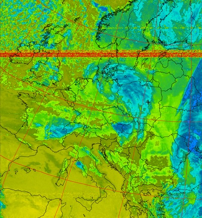

# autowx2

The set of scripts for automatic processing of the satellite data (like capturing of the weather APT images from NOAA satellites) and fixed time recordings (like WeatherFaxes).

  

This is a rewritten and fine-tuned version of tools for the automatic weather satellite images capturing. Most directly it bases on cyber-atomus' [autowx](https://github.com/cyber-atomus/autowx) and my fork of autowx. The main differences between this project **autowx2** and previously created tools:
- high modularity - all recording and processing are done by separate scripts (modules? plugins?), which can be easily configured to meet one's needs. The main module (called *noaa*) is devoted to the capture of weather data from the NOAA satellites.
- configurability - most (all?) variables can be set up in the config file. For both: the main program and the NOAA module.
- simplicity (not sure if this is true). List of observed satellites is defined in one place only (the config file) and can be easily modified.

<!--- [](https://ghit.me/repo/filipsPL/autowx2) -->


## used libraries and acknowledgements

- [autowx](https://github.com/cyber-atomus/autowx)
- [parse-crontab](https://github.com/josiahcarlson/parse-crontab) - the python crontab parser

# hardware requirements

- usb dvbt dongle, like RTL2832 DVB-T tuner
- antenna good enough to capture the signal of your interest. For antenna dedicated for capturing NOAAs telemetry, see a [simple 137 MHz V-Dipole](https://www.rtl-sdr.com/simple-noaameteor-weather-satellite-antenna-137-mhz-v-dipole/), for example. If you want to use the script _also_ for other applications (capturing APRS signals, using `dump1090` for tracking airplanes), any broadband antenna should be good.

# system requirements

- python 2.7 and bash (sh, csh will be also OK)
- [pypredict](https://github.com/nsat/pypredict) for prediction of satellite passes
- `rtl-sdr` - can be found in many distributions (`aptitude install rtl-sdr`)
- python - dateutils (`aptitude install python-dateutil`)
- `kal` from `kalibrate-rtl` (or [any of its forks](https://github.com/steve-m/kalibrate-rtl/network)) - if you want to calibrate your dongle periodically; may not be necesarry for good dongles with a stable drift.

# how to use

## files, subprograms and configs

### autowx.py

The main program to do all calculation, pass predictions and launch modules.

```
autowx2.py          - the main program, the governor of all other programs and scripts
autowx2_conf.py     - the config file
```

### autowx2_conf.py

The config file of the main program.

**satellitesData** - the dictionary (in the python style) of satellites to be observed and processed (eg., weather satellites) OR fixed times for recordings (eg., listening to the WeatherFax transmissions).
- for the *satellites*, three values must be set:
  - the satellite name (eg., 'NOAA-18'), must be the same as one found in TLE file
  - `freq` - the frequency to listen at
  - `processWith` - the path to the script/module to run during the transit
- for the fixed time recordings:
  - the id of the entry (any arbitrary string is ok)
  - `freq` - the frequency to listen at
  - `processWith` - the path to the script/module to run
  - `fixedTime` - the fixed time of recording in the [cron](https://en.wikipedia.org/wiki/Cron#Overview) style.
  - `fixedDuration` - the duration of the recording


Sample `satellitesData` dictionary:

```
satellitesData = {
    'NOAA-18':      {'freq': '137912500', 'processWith': 'modules/noaa/noaa.sh' },
    'NOAA-15':      {'freq': '137620000', 'processWith': 'modules/noaa/noaa.sh' },
    'NOAA-19':      {'freq': '137100000', 'processWith': 'modules/noaa/noaa.sh' },
    'ISS':   {'freq': '145800000', 'processWith': 'modules/iss/iss_voice.sh' },   # voice channel
    'PR3_NEWS': {'freq': '98988000', 'processWith': 'modules/fm/fm.sh', 'fixedTime': '0 7-23 * * *', 'fixedDuration': '300' },
}
```


### bin directory

Various auxiliary programs.

```
aprs.sh             - aprs script to listen to and decode APRS data; to be run in free time
kalibruj_initial.sh - calibrating script - initialization
kalibruj.sh         - calibrating script - getting the drift
update-keps.sh      - keplers updated; can/should be run from cron
```

### modules

Modules/plugins to capture various types of data. Can be customized by any type of script (here bash scripts were used in most cases).

```
fm      - sample module to record FM radio to mp3 file
iss     - module for capturing data from ISS. Currently voice channel (NOT TESTED)
noaa    - module for capturing weather data from NOAA satellites (see below)
```

#### /modules/noaa

Module for capturing weather data from NOAA satellites.

```
noaa.conf           - configuration file (bash style)
noaa.sh             - the main module file (bash) - launches below files:
noaa_record.sh      - recordinf of a sound via rtl_fm
noaa_process.sh     - processing of the recorded wav file, generates maps etc.

tests               - directory with a test data
```

### var directory

Variable data.

```
dongleshift.txt     - current dongle shift
tle                 - directory with tle data
```

# to do

## to do

- [ ] good README.md file :running: in progress
- [ ] logs to file, not only to screen
- [ ] plots of the dongle shift drift
- [ ] average dongle shifts from the last n measurements 
- [ ] coś lepszego niż `kal`, żeby było bardziej idioten proof i error proof
- [ ] coś do robienia w wolnej chwili
- [ ] efficiently kill aprs or other app from the python - [ ] now it remains running in te background... (multimon)
- [ ] run recordings on the specified fixed time (for weather fax, for example)
- [ ] ISS / rtl_fm parameters for recording
- [ ] any other cool satellites to record and process?
- [ ] switch off dongle calibration and move it to a separate external file
- [ ] gallery from images + descriptions
- [ ] priorities of recordings if the time of recording overlap :questionmark:

## to test

- [ ] move all recordings to the bash file
- [ ] noaa.sh
  - [ ] noaa_record.sh
  - [ ] noaa_process.sh
  

## done!

- [x] recording options
- [x] bash scripts global config file
- [x] if newdongleShift != '' # WARNING and newdongleShift is numeric:
